# 0217-EXCEL-VBA-Les_fonctions_utiles_manquantes

## 000. Actuces VBA

**Dossier : 000-astuces_vba**

### 000.01 Afficher un retour à la ligne dans la cellule à partir du code VBA

Grâce au caratère **Chr(10)** :

```
    texteAAfficherDansLaCellule = "Bonjour" & Chr(10) & "et" & Chr(10) & "Bienvenue"
```

Résultat dans la cellule :

```
    Bonjour
    et
    Bienvenue
```

_Source : [Retour à la ligne dans une cellule](https://www.developpez.net/forums/d491345/logiciels/microsoft-office/excel/macros-vba-excel/retour-ligne-cellule/)_

### 000.02 Continuer le code VBA sur une nouvelle ligne


Grâce à **" _"** en fin de ligne (juste "Espace Underscore")

Une ligne de code sur **une** ligne :

```
    texteAAfficherDansLaCellule = "Bonjour" & Chr(10) & "et" & Chr(10) & "Bienvenue"
```

Une ligne de code sur **plusieurs** lignes :

```
    texteAAfficherDansLaCellule = "Bonjour" _
                                  & Chr(10) _
                                  & "et" _
                                  & Chr(10) _
                                  & "Bienvenue"
```

Résultat dans la cellule :

```
    Bonjour
    et
    Bienvenue
```

_Source : [Continuer le code VBA sur une nouvelle ligne](https://excel-malin.com/vba-astuces/continuer-code-vba-sur-nouvelle-ligne/)_

## 001. Obtenir les codes HEX, RGB et DEC des couleurs par les fonctions VBA concaténées VBA (Déterminer et identifier l'index de couleur d'arrière-plan des cellules sans Excel)

**Dossier : 001-getColorsCodesFromACell**

Dans la cellule Excel qui fait référence à l'autre cellule colorée (Cellule) :
```
=CONCATENER(getHexRgbColorsCodes(Cellule);getDecColorsCodes(Cellule))
```

Dans l'**éditeur VBA**, créer un **Module1** dans les **Modules** du projet VBA (**VBAProject**), ajouter **les 2 fonctions suivantes** et enregistrer :
* **getHexRgbColorsCodes**
* **getDecColorsCodes**

```
Function getHexRgbColorsCodes(FCell As Range) As String
    
    'Code HEX
    Dim hexColor As String
    hexColor = CStr(FCell.Interior.Color)
    hexColor = Right("000000" & Hex(hexColor), 6)

    'Code RGB
    Dim rgbColor As Long
    Dim R As Long, G As Long, B As Long
    rgbColor = FCell.Interior.Color
    R = rgbColor Mod 256
    G = (rgbColor \ 256) Mod 256
    B = (rgbColor \ 65536) Mod 256

    ' _ (Espace Underscore) : pour continuer le code VBA sur une nouvelle ligne
    'Chr(10): pour revenir à la ligne dans une cellule

    getHexRgbColorsCodes = "HEX " & Right(hexColor, 2) & Mid(hexColor, 3, 2) & Left(hexColor, 2) _
                            & Chr(10) _
                            & "RGB " & R & " " & G & " " & B _
                            & Chr(10) _

End Function
```

```
Function getDecColorsCodes(FCell As Range, Optional Opt As Integer = 0) As String

    'Code DEC
    Dim decColor As Long
    Dim R As Long, G As Long, B As Long
    decColor = FCell.Interior.Color
    R = decColor Mod 256
    G = (decColor \ 256) Mod 256
    B = (decColor \ 65536) Mod 256
    Select Case Opt
        Case 1
            getDecColorsCodes = R
        Case 2
            getDecColorsCodes = G
        Case 3
            getDecColorsCodes = B
        Case Else
            getDecColorsCodes = "DEC " & decColor
    End Select
End Function
```

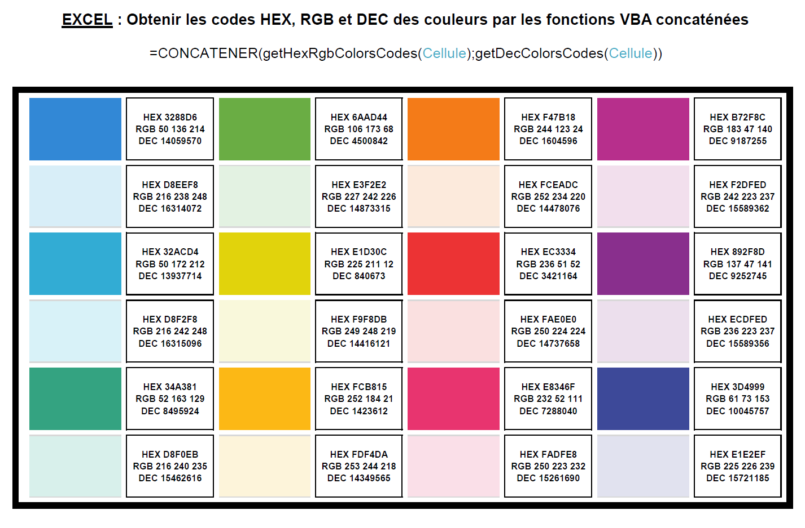
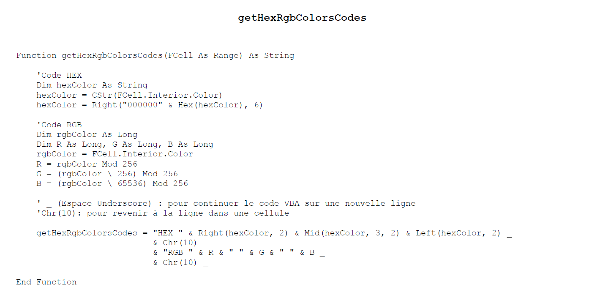
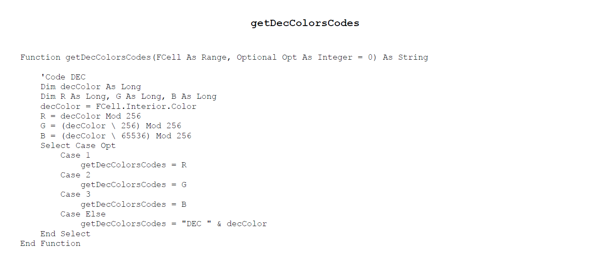


_Source : [Déterminer et identifier l'index de couleur d'arrière-plan des cellules sans Excel](https://fr.extendoffice.com/documents/excel/4546-excel-determine-color-of-cell.html)_

## 002. Identifier les commentaires en couvrant les indicateurs de commentaire (petits triangles rouges en haut à droite dans les cellule) par des triangles bleus plus gros (formes)

**Dossier : 002-identifyCommentIndicators**

### Usage

1. Visualiser les indicateurs de commentaires

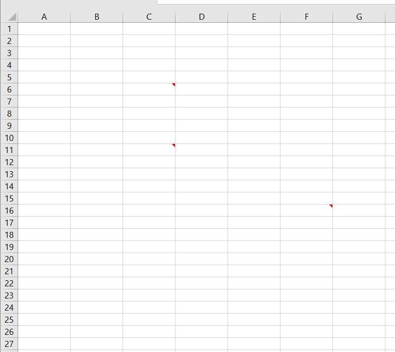

2. Lire les commentaires

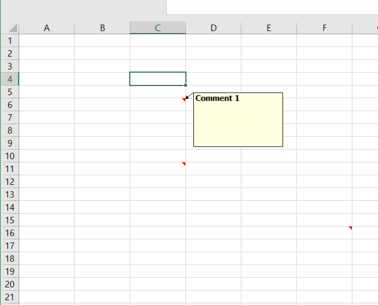

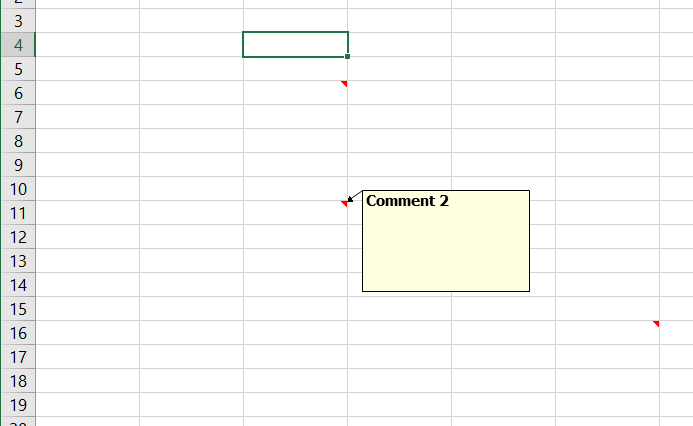

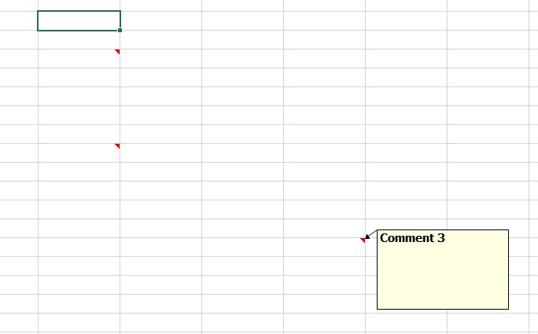

3. Appeler les macros : <kbd>ALT</kbd> + <kbd>F8</kbd> et double-cliquer sur `AddBigBlueTriangleOnCommentIndicator`

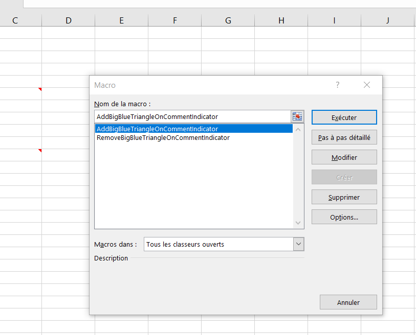

4. Résutat :

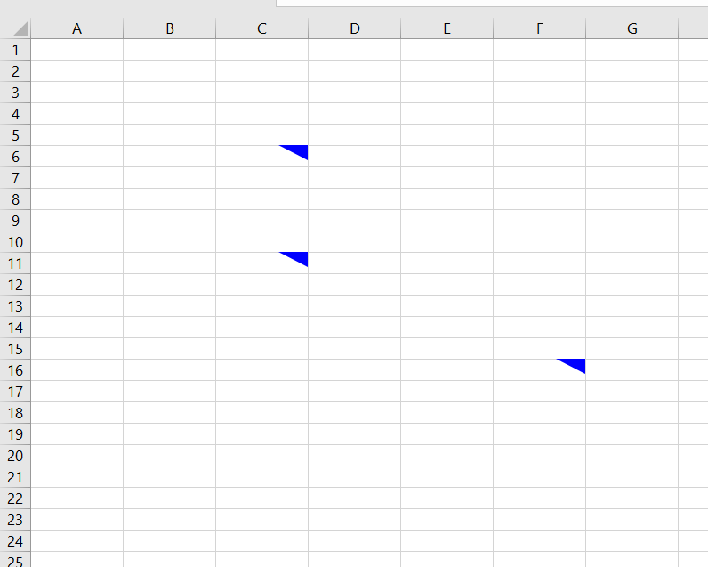

5. Appeler les macros : <kbd>ALT</kbd> + <kbd>F8</kbd> et double-cliquer sur `RemoveBigBlueTriangleOnCommentIndicator`

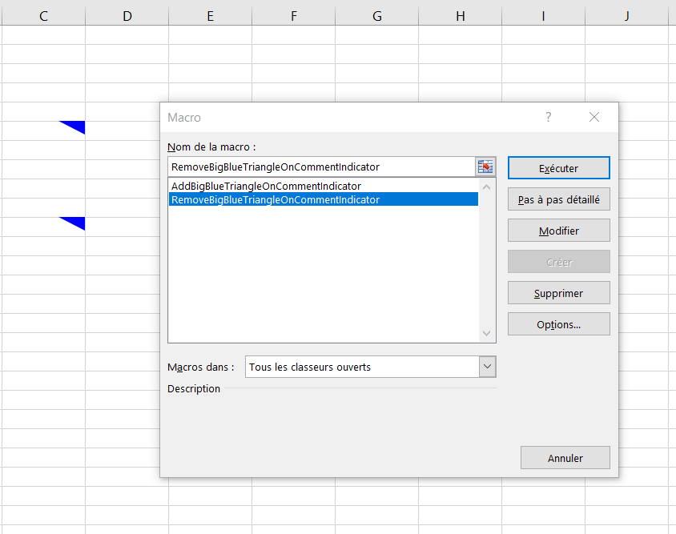

4. Résutat :

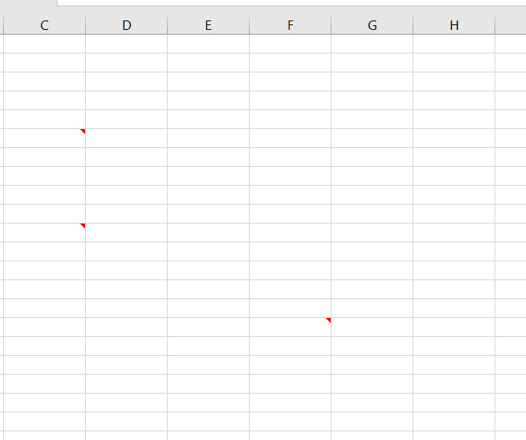

### Création

Dans l'**éditeur VBA**, créer un **Module1** dans les **Modules** du projet VBA (**VBAProject**), ajouter **les 2 procédures (Sub)** suivantes et enregistrer :
* **AddBigBlueTriangleOnCommentIndicator**
* **AddBigBlueTriangleOnCommentIndicator**

```
Sub AddBigBlueTriangleOnCommentIndicator()

    Dim pWs As Worksheet
    Dim pComment As Comment
    Dim pRng As Range
    Dim pShape As Shape
    Set pWs = Application.ActiveSheet
    wShp = 20
    hShp = 10
    For Each pComment In pWs.Comments
        Set pRng = pComment.Parent
        Set pShape = pWs.Shapes.AddShape(msoShapeRightTriangle, pRng.Offset(0, 1).Left - wShp, pRng.Top, wShp, hShp)
        With pShape
            .Flip msoFlipVertical
            .Flip msoFlipHorizontal
            .Fill.ForeColor.SchemeColor = 12
            .Fill.Visible = msoTrue
            .Fill.Solid
            .Line.Visible = msoFalse
        End With
    Next
    
End Sub
```

```
Sub RemoveBigBlueTriangleOnCommentIndicator()

    Dim pWs As Worksheet
    Dim pShape As Shape
    Set pWs = Application.ActiveSheet
    For Each pShape In pWs.Shapes
        If Not pShape.TopLeftCell.Comment Is Nothing Then
            If pShape.AutoShapeType = msoShapeRightTriangle Then
                pShape.Delete
            End If
        End If
    Next
    
End Sub
```


